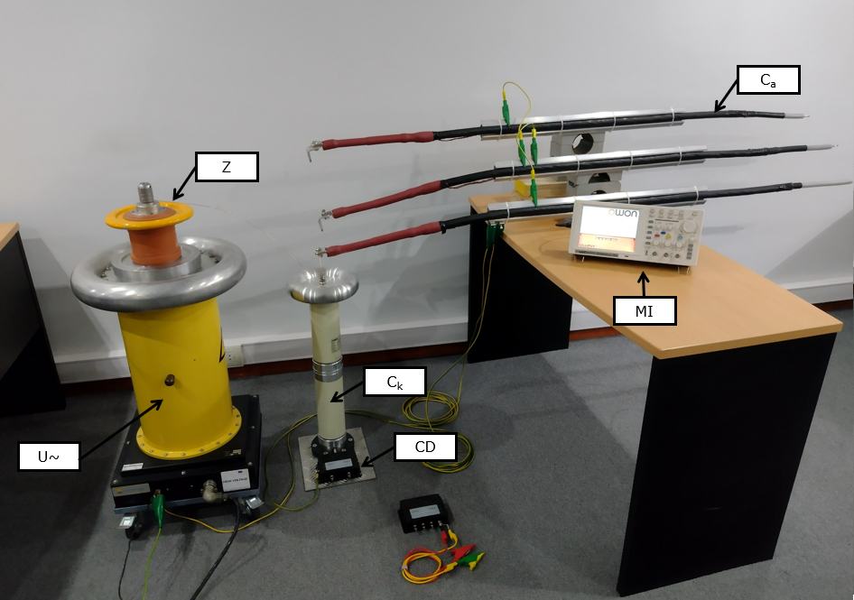
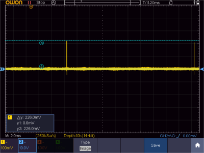
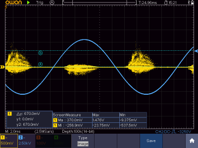

# Medición de descargas parciales con un osciloscopio \[ES\]

## Introducción
Si bien existen diferentes empresas especializadas en la medición de descargas parciales con sus sofisticados instrumentos. Es posible obtener resultados similares y a un costo inferior si se conoce como funcionan estos equipos.

En esta entrada del blog se muestra un desarrollo desde cero de un instrumento de medición de descargas parciales.

## Definiciones
Primero unas pequeñas definiciones extraidas de la IEC 60270 "High-voltage test techniques –
Partial discharge measurements" para saber de que estamos haciendo referencia cuando hablamos de descargas parciales:

- **Descarga parcial (PD)**: Descarga electrica localizada que puentea parcialmente la aislacion entre conductores y puede o no ocurrir de forma adyacente a un conductor.

- **Pulso de PD**: Pulso de corriente o tensión que se genera como resultado de la descarga parcial. Este pulso es medido por el cuadripolo de medición.

## Componentes necesarios
En la imagen siguiente se observan todos los elementos necesarios para la medicion de PD:

Los mismos corresponden al siguiente circuito electrico de la norma IEC 60270:

La función de cada uno es:

- **U~**: Es una fuente de tensión que según el caso puede ser resonante o no. Debe proveer una tensión superior al voltage de incepción de la muestra a ensayar.
- **Z**: Este filtro consiste en un inductor de choque y evita que los pulsos de altas fecuenciencias provenientes de la fuente de tensión se propaguen hacia el circuito de medición. Tambien evita que los pulsos de PD se dirijan hacia la fuente de tensión sin pasar por el circuito de medición.
- **Ca**: Es el objeto bajo prueba. Como la frecuencia de los fenomenos de PD son del orden de los kilo-Hertz la aislación se modelara como una capacidad.
- **Ck**: Es el capacitor de acople, permite captar los pulsos de PD ya que esta conectado en paralelo a la muestra. En serie a este se conecta el cuadripolo de medición (coupling device)
- **CD**: Es un filtro pasa banda, con un ancho de: $100 kHz \le \Delta f \le 400 kHz$
y una frecuencia de corte inferior y superior de: $30 kHz \le f_1 \le 100 kHz$ y $f_2 \le 500 kHz$ respectivamente.
- **MI**: Es un osciloscopio con una tasa de muestreo superior a $100 MS/s$. En el mismo se visualizaran los patrones de las PD.

## Ensayo
Como primera medida se debe calibrar el sistema de medición. Para esto se coloca el calibrador entre los terminales de la muestra $C_a$ y se inyecta un pulso conocido de carga. Sobre el instrumento de medición se podrán observar los picos de esta carga.

Si colocamos un curso sobre el maximo de los picos tendremos una lectura equivalente del voltage que representa una descarga de carga electrica sobre el conjunto de capacidades $C_a$ y $C_k$.

Luego se retira el calibrador y se comienza a aplicar tensión alterna. Primero a $2U_0$ durante 15 segundos para alcanzar la tensión de incepción y luego a $\sqrt3 U_0$ durante 60 segundos para sostener la actividad de PD. $U_0$ es la tensión de fase del cable que se esta ensayando.

Para este caso se sumo la opción de persistencia sobre el display del osciloscopio. De esta manera se obtienen resultados similares a equipos comerciales como el *ICM Compact* de *PowerDiagnostix*:

