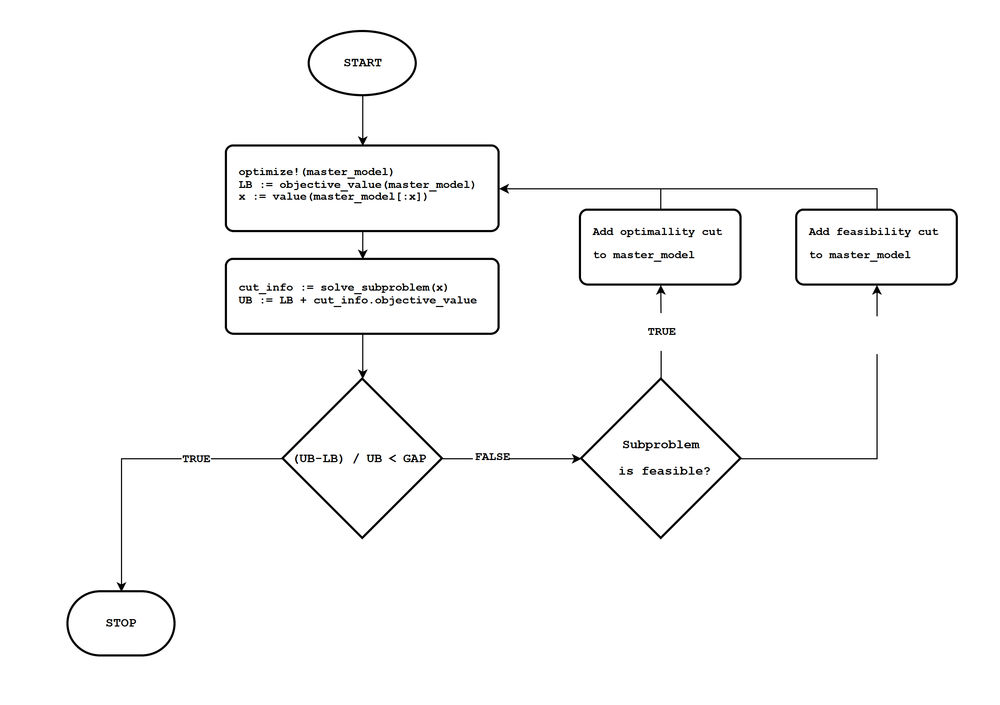

# Benders decomposition

## Introduction
Benders decomposition is a mathematical optimization technique used to solve mixed-integer linear programming (MILP) problems. It is a two-phase method that separates the problem into two subproblems: a "master problem" and a "subproblem."

The master problem is a linear programming (LP) problem that consists of the continuous variables and a set of optimality conditions (called Benders cuts) that define the feasible region for the integer variables. The subproblem is a feasibility problem for the integer variables and is solved for each iteration of the master problem.

Benders decomposition can be useful in solving large and complex mixed-integer linear programming problems that cannot be solved by traditional optimization techniques. It is also useful in problems where the feasible region for the integer variables is not well defined and requires multiple iterations to converge to an optimal solution.

## Decomposition method

For a given problem:

$$
\begin{aligned}
& \min_{x, y} f'x+c'y\\
& \text{s.t.}\\
& Ex + Fy \le h\\
& x \in \mathcal{X}\\
& y \in \mathcal{Y}
\end{aligned}
$$


Can be broken down into two stages

$$
\min_{x \in \mathcal{X}}\lbrace
f'\hat{x}+
\min_{y \in \mathcal{Y}}{
\lbrace
c'y : Fy\le h-E\hat{x}
\rbrace
}
\rbrace
$$

The inner problem is, generally, solved by it is dual formulation:

$$
\begin{aligned}
& \max_{\lambda} J(\lambda)=\lambda'(h-E\hat{x})\\
& \text{s.t.}\\
& \lambda'F \le c\\
& \lambda \ge 0
\end{aligned}
$$

That give us the following cuts:
- For optimal dual subproblem: 
  - $\lambda'(h - Ex)\le z$
- For infeasible dual subproblem:
  - $\lambda'(h - Ex)\le 0$

This is equivalent (in the LHS) to take the objective value and add the sensitivity of the $x$ variables.

$$\lambda'(h - Ex) = \mu (x-\hat{x})$$

with:

$$\mu_i = \frac{\partial J}{\partial x_i}$$

So, another expresion for the cuts are:
- For optimal dual subproblem: 
  - $J(\lambda^*) + \mu(x - \hat{x})\le z$
- For infeasible dual subproblem:
  - $J(\lambda^*) + \mu(x - \hat{x})\le 0$

One can think of it as a linear aproximation of the inner problem injected into the master:

$$
\begin{aligned}
& \min f'x + z\\
& \text{s.t.}\\
& \lambda'(h-Ex)\le 0 \quad \lambda \in \Lambda_{inf}\\
& z \ge \lambda'(h - Ex) \quad \lambda \in \Lambda_{opt}\\
& x \in \mathcal{X}
\end{aligned}
$$

where the sets $\Lambda$ are updated iteration by iteration.

## Flowchart



## Code example
The following code shows an example. It is similar to the JuMP documentation [example](https://jump.dev/JuMP.jl/stable/tutorials/algorithms/benders_decomposition/#In-place-iterative-method).

```julia
using GLPK, JuMP

function solve_benders(E, F, h, f, c)
    N = length(E[1, :])
    M = length(F[1, :])
    optimizer = optimizer_with_attributes(GLPK.Optimizer)

    master_model = Model(optimizer)
    @variable(master_model, x[1:N] >= 0, Int)
    @variable(master_model, z >= 0)
    @objective(master_model, Min, f' * x + z)

    subproblem = Model(optimizer)
    @variable(subproblem, x_copy[1:N] >= 0)
    @variable(subproblem, y[1:M] >= 0)
    @constraint(subproblem, E * x_copy + F * y .<= h)
    @objective(subproblem, Min, c' * y)

    function solve_subproblem(subproblem, x)
        fix.(subproblem[:x_copy], x; force=true)
        optimize!(subproblem)
        return Dict(
            "status" => termination_status(subproblem),
            "objective" => objective_value(subproblem),
            "y" => value.(subproblem[:y]),
            "μ" => reduced_cost.(subproblem[:x_copy])
        )
    end

    @info "iteration\tlower_bound\tupper_bound"
    for k in 1:MAX_ITERATIONS
        optimize!(master_model)
        lower_bound = objective_value(master_model)
        x_k = value.(x)
        subproblem_info = solve_subproblem(subproblem, x_k)
        upper_bound = lower_bound + subproblem_info["objective"]
        @info "$k\t$lower_bound\t$upper_bound"
        (upper_bound - lower_bound) / upper_bound <= GAP && break
        if subproblem_info["status"] == MOI.INFEASIBLE
            cut = @constraint(master_model, subproblem_info["objective"] + subproblem_info["μ"]' * (x - x_k) <= 0)
            @info "Adding cut: $cut"
        else
            cut = @constraint(master_model, subproblem_info["objective"] + subproblem_info["μ"]' * (x - x_k) <= z)
            @info "Adding cut: $cut"
        end
    end

    return objective_value(master_model)
end
```

If we try a simple model:
```julia
E = [1 -3; -1 -3]
F = [1 -2; -1 -1]
h = [-2; -3]
f = [1, 4]
c = [2, 3]

solve_benders(E, F, h, f, c)
```


That gives the following output:
```
[ Info: iteration       lower_bound     upper_bound
[ Info: 1       0.0     7.6
[ Info: Adding cut: -2 x[1] - 8 x[2] - z ≤ -7.6
[ Info: 2       4.0     13.0
[ Info: Adding cut: 1.5 x[1] - 4.5 x[2] - z ≤ -3.0
[ Info: 3       4.0     4.0
```
In which we can see the convergence to the optimal value of 4.

## **References**
```
@article{geoffrion1972generalized,
  title={Generalized benders decomposition},
  author={Geoffrion, Arthur M},
  journal={Journal of optimization theory and applications},
  volume={10},
  pages={237--260},
  year={1972},
  publisher={Springer}
}
```