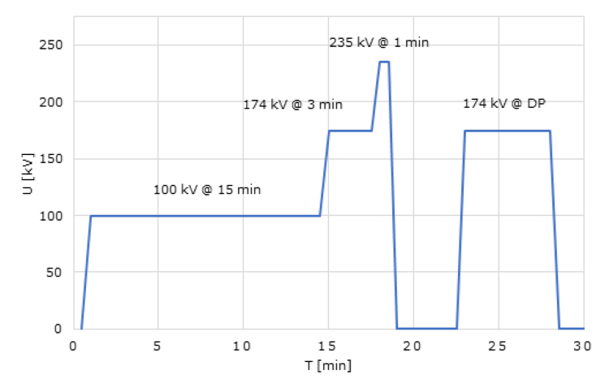
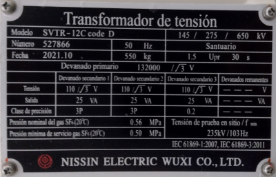
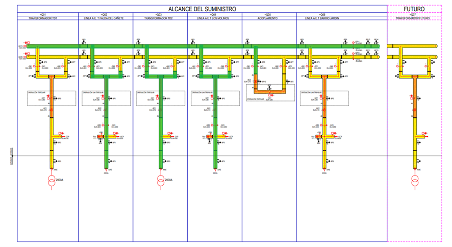
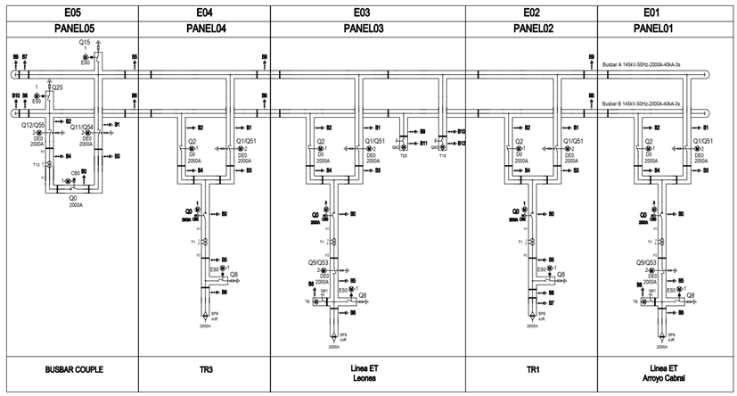

# Mixed integer problem to solve test sequence on a GIS

## What is a GIS?
A gas insulated substation (GIS) is a high voltage substation in which the major  conducting structures are contained within a sealed environment with a dielectric gas known as SF6, or sulfur hexafluoride gas as the insulating medium.

In comparison, a conventional (AIS) or Air-Insulated Substation, uses atmospheric air as the dielectric gas medium, as these types of substations primarily consist of outdoor facilities.


## Commisioning a GIS
The HV dielectric test is done according to IEC 62271-203 / IEC 60694. It consist in applying voltage in differents steps with the following profile of time:



The frequency of this voltage could be different from the power frequency. This allows us to use resonant test equipments.

## Limitations in the test


The test equipment is a resonant series equipment. Trough a fixed inductance $L$ and a variable frequency $f$, given by the power supply the resonant point is:

$$f = \frac{1}{2\pi \sqrt{LC}}$$

Where $C$ is the capacitance of the GIS plus the voltage divider capacitor plus any stray capacitance.

One of the main problems of this test equipment is that with a fixed inductance we cannot change the relationship of how much $C$ we can test at a given frequency $f$. This leads to problems in the saturation of the voltage transformers (VT). In the image below we can see a nameplate of a VT.



As a conclusion the frequency cannot be below as $103 Hz$ so we need to split the GIS in different sections to have a sufficient low capacitance to not drop too much the frequency.

In the following picture we can see that we only be able to test only the green parts of the single line diagram.



## Problem formulation

The main problem is how we can test all the GIS doing as few tests as posible. Our constraint is the capacitance of the test section, that must be below some value to not get a drop of frequency below $103 Hz$. The other constraint is that at the end of the tests sequences all the bays and busbars were tested.

Our experience allows us to do a relationship of meters of GIS duct per type of bay.

|Type of element| Equivalent Meters|
|---|---|
|Transformer Module     |5.8|
|Overhead Line Module   |4  |
|BusBar Coupler         |2  |
|BusBar                 |10 |


This equivalent meters is a good aproximation for a general GIS type. For our equipment the maximum length of equivalent duct is $20m$.

For the new GIS to test we have the following single line diagram:



That we gave us the following combinatory problem:

```julia
using JuMP
using Cbc

# Data definition
bays = ["E0$i" for i in 1:5]
busbars = ["BBA", "BBB"]
elements = [bays..., busbars...] 
c = [4, 5.8, 4, 5.8, 2, 10, 10]
c_max = 20
n = 3

# Create a model
# `x_ij` is the decision of test equipment i in test j 
m = Model(Cbc.Optimizer)
@variable(m, x[i in elements, j=1:n], binary=true)

# Any bay must be tested at least once
for i in bays
	@constraint(m, sum(x[i,j] for j in 1:n) >= 1)
end

# Any busbar must be tested at least once
for j in 1:n
	@constraint(m, sum(x[i,j] for i in busbars) == 1)
end

# There is a fixed point to inject the voltage
for j in 1:n
	@constraint(m, x["E01", j] == 1)
end

# Any test must have a maximum equivalent lenght (drop frequency problem)
for j in 1:n
	@constraint(m, c' * x[:, j] <= c_max)
end

# Solve the model and prints results
optimize!(m)
JuMP.value.(x)
```

The results that we have is the following test sequence:

|Equipment|Test 1|Test 2|Test 3|
|---|---|---|---|
|E01|   On	|On  |On
|E02|   On	|Off |Off
|E03|   Off	|On  |Off
|E04|   Off	|Off |On
|E05|   Off	|On  |Off
|BBA|   Off	|On  |On
|BBB|   On	|Off |Off
|*Total meters*| 19.79| 20.00| 19.79|


