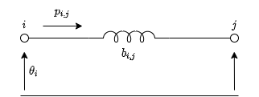

# Resolución de flujos óptimos de potencia en Python \[ES\]

En este artículo se mostrara como utilizar el uso de la programación orientada a objetos con el módulo `cvxpy`  para resolver el problema de flujo óptimo de potencia (OPF).

## Introducción al OPF

La finalidad del flujo óptimo de potencia consiste en obtener el estado de los generadores, las tensiones en las barras, los intercambios de potencia entre áreas y otras variables de estado relevantes a la red eléctrica; De forma tal de que minimice / maximice algún objetivo. 

En este caso se buscara minimizar el costo de generación para un determinado perfil de carga. Dando lugar a la siguiente función objetivo:

$$
\min \sum_{i \in G}{c_ip^g_i}
$$

Donde $c_i$ es el costo de generación de la unidad $i$ y la cantidad de potencia despachada para esa unidad será $p^g_i$.

Tener solamente esta función objetivo sería tener una visión incompleta del problema ya que se debe tener en cuenta que la potencia generada deberá equiparar a la potencia que se demanda en ese instante de operación de la red. Esto hace a que el problema se convierta en una optimización con restricciones.

Para capturar el balance de potencias en cada barra se utilizara la siguiente expresión:

$$
p^g_i - p^d_i = \sum_{ij\in E_i}{p_{ij}}, \forall i \in N
$$

Aquí $p_i^d$ es la cantidad de potencia que se demanda en la barra $i$ y $p_{ij}$ representara los flujos de potencia que se intercambian con barras adyacentes a través de líneas de transmisión y transformadores.

Para modelar estos intercambios de potencia entre barras se utilizara un modelo lineal denominado `DC-Power Flow`. El cual consiste en despreciar las perdidas en los circuitos y asumir que las magnitudes de tensiones entre el emisor y el receptor se mantienen constantes en 1 p.u.





$$
p_{ij} = b_{ij}(\theta_i-\theta_j), \forall (i, j) \in E
$$

Aquí $b_{ij}$  es la susceptancia de la línea de transmisión (inversa de la reactancia) y los valores de $\theta$ representan los ángulos de las tensiones de las barras donde se halla conectada la línea.

Si bien con las restricciones vistas uno modela físicamente la dinámica del sistema, es necesario tener en cuenta las restricciones operativas de los elementos involucrados.

$$
p_i^{g-min}\le p_i^g \le p_i^{g-max}, \forall i \in G
$$

$$
-p_{ij}^{max} \le p_{ij} \le p_{ij}^{max}, \forall (i,j) \in E
$$

Por ultimo, para tener una referencia angular de tensiones, se tomara una barra de referencia (*slack bus*):

$$
\theta_s=0, \forall s \in B_s
$$

## Implementación en python

### Sintaxis y uso elemental de cvxpy

La formulación de un problema de optimización en `cvxpy` se realiza mediante diferentes objetos que representan variables, expresiones y restricciones de un problema de optimización. En el siguiente bloque de código se muestra un ejemplo mínimo de uso de esta herramienta.

```python
import cvxpy

# Variable de optimizacion:
x = cp.Variable()

# Restricciones
constraints = [x ** 2 <= 4]

# Instancia del problema
problem = cp.Minimize(x, constraints)

# Resolucion
prob.solve()

# Imprimir resultado
print("El valor de x es {:.2f}".format(x))
```

### Representación de los componentes de una red eléctrica

Viendo que se puede manipular expresiones a través de generarlas y guardarlas en listas, mientras que las variables del modelo quedan ligadas entre sí en la instanciación del problema; Se crearan los objetos `Bus` , `Generator` y `Line` de manera de tener una representación modular del sistema eléctrico de potencia. Donde el método `constraints` devuelva una lista de restricciones propia de cada elemento.

En resumen a la sección anterior tendremos las siguientes componentes que modelar en un sistema de potencia:

- Barras
    - Ángulo de tensión (variable de optimización)
    - Balance de potencia (restricción)
    - Potencia demandada (parámetro)
- Generadores:
    - Potencia activa generada (variable de optimización)
    - Límites del generador (restricción)
- Líneas:
    - Flujo de potencia (restricción)
    - Limite térmico de operación (restricción)

### Objeto para la representación de Barras

```python
class Bus:
    """A generic bus in power system"""
    def __init__(self):
        self.angle = cp.Variable()
        self.power_injections = []
        
    def constraints(self):
        return [sum(p for p in self.power_injections) == 0]

  
class SlackBus:
    """A reference bus with fixed angle"""    
    def __init__(self):
        self.angle = 0
        self.power_injections = []
        
    def constraints(self):
        return [sum(p for p in self.power_injections) == 0]

class Demand:
    """Fixed demand"""
    def __init__(self, bus, demand):
        self.bus = bus
        self.demand = demand
        self.bus.power_injections.append(-self.demand)
        
    def constraints(self):
        return []
```

### Objeto para la representación de Generadores

```python
class Generator:
    """A simple generator"""
    def __init__(self, bus, rate, cost):
        self.bus = bus
        self.rate = rate
        self.cost = cost
        self.power = cp.Variable(nonneg=True)
        self.bus.power_injections.append(self.power)

    def constraints(self) -> list:
        return [self.power <= self.rate]
    
    def generation_cost(self):
        return self.power * self.cost
```

### Objeto para la representación de Líneas

```python
class Line:
    """DC flow model of a power transmission line"""
    def __init__(self, from_bus, to_bus, susceptance, rate):
        self.from_bus = from_bus
        self.to_bus = to_bus
        self.susceptance = susceptance
        self.rate = rate
        self.from_bus.power_injections.append(-self.power_injection())
        self.to_bus.power_injections.append(self.power_injection())
    
    def power_injection(self):
        b = self.susceptance
        theta_i = self.from_bus.angle
        theta_j = self.to_bus.angle
        return b * (theta_i - theta_j)
    
    def constraints(self) -> list:
        return [cp.abs(self.power_injection()) <= self.rate]
```

## Ejemplo mínimo de uso:

Se tomara como ejemplo un caso pequeño de 3 barras correspondiente a la librería [PGLIB](https://github.com/power-grid-lib/pglib-opf/blob/master/pglib_opf_case3_lmbd.m) 

```python
# Datos:
buses = [
    SlackBus(),
    Bus(),
    Bus()
    ]

generators = [
    Generator(buses[0], 20, 5.0),
    Generator(buses[1], 20, 1.2)
    ]

demands = [
    Demand(buses[0], 1.10),
    Demand(buses[1], 1.10),
    Demand(buses[2], 0.95)
    ]

lines = [
    Line(buses[0], buses[1], 1.11, 2.0),
    Line(buses[0], buses[2], 1.61, 2.0),
    Line(buses[1], buses[2], 1.33, 0.5)
    ]
```

La formulación del problema se creara generando una lista de restricciones y una función objetivo:

```python
# Generacion de restricciones
constraints = []
for obj in buses + generators + lines:
    constraints += obj.constraints()

# Creacion de instancia del problema
prob = cp.Problem(
    cp.Minimize(sum(gen.generation_cost() for gen in generators)),
    constraints,
    )

# Resolucion del problema
prob.solve()
```

Para presentar los resultados se los imprimió en pantalla de la siguiente manera:

```python
# Resultado
print(f"Objetivo:\t{prob.value:.2f}")

print("\nGeneradores:")
for i, gen in enumerate(generators):
    print(f"Generador {i}:\t{gen.power.value:.2f} MW")

print("\nBuses:")
for i, bus in enumerate(buses):
    if isinstance(bus, Bus):
        print(f"Bus {i}:\t{bus.angle.value:.3f}\trad")
    else:
        print(f"*Bus {i}:\t{bus.angle:.3f}\trad")
        
print("\nLíneas:")
for i, line in enumerate(lines):
    print(f"Línea {i}:\t{line.power_injection().value:.2f} MW")
```

```
Objetivo:	9.26

Generadores:
Generador 0:	144.30 MW
Generador 1:	170.70 MW

Buses:
*Bus 0:	0.000	rad
Bus 1:	0.096	rad
Bus 2:	-0.280	rad

Líneas:
Línea 0:	-10.70 MW
Línea 1:	45.00 MW
Línea 2:	50.00 MW
```

Donde la resolución real de este problema es:

```
%    Bus      Voltage          Generation             Load          Lambda($/MVA-hr)
%     #   Mag(pu) Ang(deg)   P (MW)   Q (MVAr)   P (MW)   Q (MVAr)     P        Q   
%   ----- ------- --------  --------  --------  --------  --------  -------  -------
%       0  1.100    0.000*   148.07     54.70    110.00     40.00    37.575     -
%       1  0.926    7.259    170.01     -8.79    110.00     40.00    30.101     -
%       2  0.900  -17.267      0.00     -4.84     95.00     50.00    45.537     -
%                           --------  --------  --------  --------
%                  Total:    318.07     41.06    315.00    130.00
```

## Conclusiones

Se puede ver que con un script sencillo y algunas hipótesis simplificativas se puede resolver el problema del flujo óptimo de potencia.

La diferencia con la resolución real del problema es bastante pequeña en cuanto al despacho de potencia de los generadores.

| Bus | P (MW) Obtenido | P (MW) Optimo | Error % |
| --- | --- | --- | --- |
| 0 | 144.30 | 148.07 | -2.54% |
| 1 | 170.70 | 170.01 | 0.41% |

En cambio los ángulos en las barras se obtiene un mayor error.

| Bus | Ang (deg) Obtenido | Ang (deg) Optimo | Error % |
| --- | --- | --- | --- |
| 0 | 0.000 | 0.000 | 0% |
| 1 | 5.500 | 7.259 | -24.23% |
| 2 | -16.043 | -17.267 | -7.08% |

La razon de esta diferencia radica en la precision del modelo matemático usado ya que en la implementación desarrollada se omitieron los flujos de potencia reactiva y las variaciones de la magnitud de la tension sobre cada una de las barras.