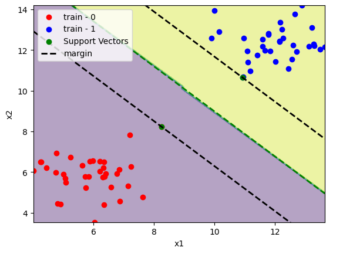
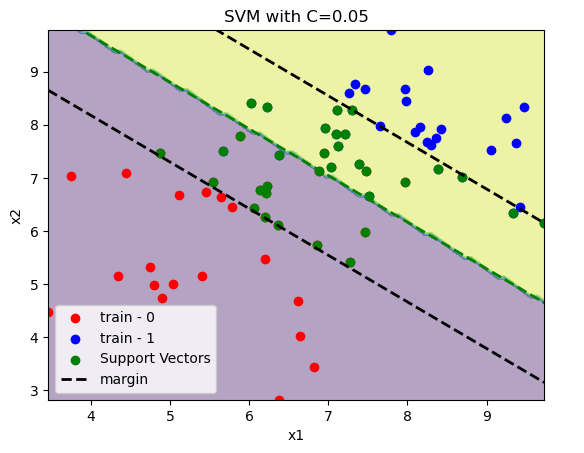
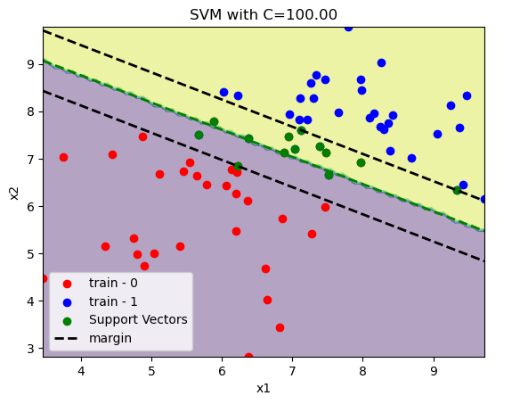
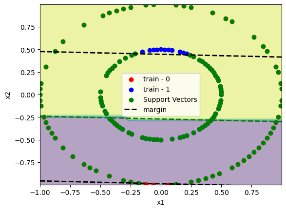
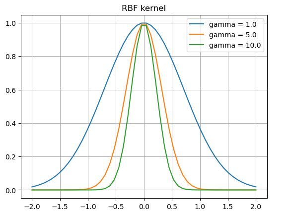
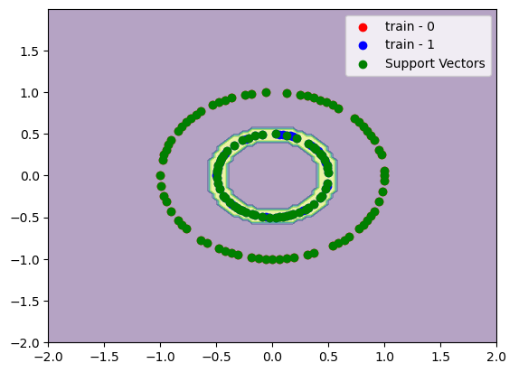

# Mathematical Formulation of SVM

In this article we developed the mathematical formulation of the soft-margin variant of the classical maximum margin linear classifier.

## How we compute the margin?

The main idea of the algorithm is to choose a lineal margin to separate both classes. If we have the point $x_1$ with $y_1 = 1$ and $x_2$ with $y_2 = -1$ as the extreme points of the clusters.

$$ w^t x_1 + b = 1 $$
$$ w^t x_2 + b = -1 $$

We can compute the margin as the difference between them as:

$$ w^t (x_1 - x_2) = 2 $$

If we normalize the left side, we get the size of the margin in the right hand side:

$$ \frac{w^t (x1 - x2)}{||w||}  = \frac{2}{||w||} $$

Finally the margin $\rho$ is:

$$ \rho = \frac{2}{||w||} $$

## Optimization model

In order to maximize the margin $\rho$ one can minimize the inverse of the margin $\frac{||w||}{2}$. To make the optimization problem more easy to solve we can get rid off the square root in the norm function and write:

$$\min_{i, \zeta}{\frac{w^t w}{2} + C \sum_{i=1}^{n}{\zeta_i}}$$

Subject to:

$$ y_i(w^t x + b) \ge 1 - \zeta ,\quad i=1..n $$
$$ \zeta_i \ge 0 ,\quad i=1..n $$

Where the first constraint states that the training points needs to be assigned to the corresponding class. In this we allow some misclassification with a cost $C$ trought the slacks variables $\zeta_i$.

## Getting the optimum of the problem

To solve this problem we can compute the Lagragian function and solve the uncostrained equivalent:

$$ \mathcal{L}(w, b, \zeta) = {\frac{w^t w}{2} + C \sum_{i=1}^{n}{\zeta_i}} +
    \sum_{i=1}^{n}{\alpha_i (1 - \zeta - y_i(w^t x + b))} +
    \sum_{i=1}^{n}{\beta_i(-\zeta_i)}
$$

> Notice the minus sign in the terms corresponding to the constraints to match the cannonical form of an optimization problem:
>$$ \min_{x} f(x)$$
>$$ g(x) \le 0 $$

The stationary point of the lagragian gives us the optimal of the problem. Taking the derivatives of the parameters and set it to zero:

$$ \frac{\partial \mathcal{L}}{\partial w} = w - \sum_{i=1}^{n}{\alpha_i y_i x_i} = 0$$
$$ \frac{\partial \mathcal{L}}{\partial b} = \sum_{i=1}^{n}{\alpha_i y_i} = 0$$
$$ \frac{\partial \mathcal{L}}{\partial \zeta} = C - \alpha_i - \beta = 0, \quad i=1..n$$

If we expand the Lagragian:

$$ \mathcal{L}(w, b, \zeta) =
    \frac{w^t w}{2}
    + \sum_{i=1}^{n}{\alpha_i}
    - \sum_{i=1}^{n}{\alpha_i y_i w^t x}
    - \sum_{i=1}^{n}{\alpha_i y_i b}
    + C \sum_{i=1}^{n}{\zeta_i}
    - \sum_{i=1}^{n}{\alpha_i \zeta_i}
    - \sum_{i=1}^{n}{\beta_i\zeta_i}
$$

And embed the stationary points of the Lagragian in the following way:

$$ \mathcal{L}(w, b, \zeta) =
    \frac{\sum_{i, j=1}^{n}{\alpha_i \alpha_j y_i y_j \langle x_i, x_j \rangle}}{2}
    - \sum_{i=1}^{n}{\alpha_i \alpha_j y_i y_j \langle x_i, x_j \rangle}
    + \sum_{i=1}^{n}{\alpha_i}
    - \sum_{i=1}^{n}{\alpha_i y_i b}
    + \sum_{i=1}^{n}{(C - \alpha - \beta)\zeta_i}
$$


1. We replace $w$ with the first expresion of the stationary point, $w = \sum_{i=1}^{n}{\alpha_i y_i x_i}$.
2. We gonna remove the term $\sum_{i=1}^{n}{\alpha_i y_i}$ because it sums zero.
3. We gonna remove the last group because $ C - \alpha_i - \beta_i = 0, \quad i=1..n $.

Now the Lagragian has the following form:

$$ \mathcal{L}(\alpha) =
    \sum_{i=1}^{n}{\alpha_i}
    -\frac{\sum_{i, j=1}^{n}{\alpha_i \alpha_j y_i y_j \langle x_i, x_j \rangle}}{2}
$$

If we put the constraints of the stationary point we get the dual problem:

$$ \max {\mathcal{L}(\alpha)} $$
Subject to
$$ \sum_{i=1}^{n}{\alpha_i y_i} = 0, \quad i=1..n$$
$$ 0 \le \alpha_i \le C, \quad i=1..n$$

The first constraints corresponds to the $\frac{\partial \mathcal{L}}{\partial b} = 0$ condition.

The second one is a little bit more tricky but since $\alpha_i \ge 0$ and $\beta_i \ge 0$ we have with $\frac{\partial \mathcal{L}}{\partial \zeta}$ an upper bound of $\alpha_i$:

$$ C - \alpha_i - \beta_i = 0 $$
$$ \beta_i = 0 \implies \alpha_i = C$$

## How we classify

Once we get the solution of the dual problem and the values of $\alpha^*$ and $b^*$ the decision boundary is given by:

$$ d(x; \alpha^*, b^*) = sign(\sum_{sv}{\alpha_i^* y_i \langle x_i, x_j \rangle} + b*)$$

Where $b^*$ can be computed with the KKT conditions:

$$ \alpha_i(y_i({w^*}^t x_i + b^*) - 1 - \zeta_i) = 0 $$
$$ \beta_i^* \zeta_i^* = 0$$

Now, the interesting part is thar the decision functions depends only on the support vectors (see the summation index). That is because $\alpha_i = 0$ for any point where the margin constraint is not binding.


## How we classify

Once we get the solution of the dual problem and the values of $\alpha^*$ and $b^*$ the decision boundary is given by:

$$ d(x; \alpha^*, b^*) = sign(\sum_{sv}{\alpha_i^* y_i \langle x_i, x_j \rangle} + b*)$$

Where $b^*$ can be computed with the KKT conditions:

$$ \alpha_i(y_i({w^*}^t x_i + b^*) - 1 - \zeta_i) = 0 $$
$$ \beta_i^* \zeta_i^* = 0$$

Now, the interesting part is thar the decision functions depends only on the support vectors (see the summation index). That is because $\alpha_i = 0$ for any point where the margin constraint is not binding.

```python
import numpy as np
from sklearn.svm import SVC
from sklearn.datasets import make_blobs
from sklearn.model_selection import train_test_split
from sklearn.inspection import DecisionBoundaryDisplay
from sklearn.metrics import accuracy_score
import matplotlib.pyplot as plt
```

```python
x, y = make_blobs(centers=[[6, 6], [12, 12]])
x_train, x_test, y_train, y_test = train_test_split(x, y, train_size=0.7)

model = SVC(kernel="linear")
model.fit(x_train, y_train)

print(f"train accuracy:\t{accuracy_score(y_train, model.predict(x_train)):.2%}")
print(f"test accuracy:\t{accuracy_score(y_test, model.predict(x_test)):.2%}")
```

In this case the dataset is linearly separable.
```
train accuracy:	100.00%
test accuracy:	100.00%
```

Lets define a function to plot it.
```python
def plot_svm(x_train, y_train, model):
    # Plot decision boundary
    xlim = np.min(x_train[:, 0]), np.max(x_train[:, 0])
    ylim = np.min(x_train[:, 1]), np.max(x_train[:, 1])
    DecisionBoundaryDisplay.from_estimator(model, x_train, response_method="predict", alpha=0.4)

    # Plot training data
    plt.scatter(x_train[y_train==0][:, 0], x_train[y_train==0][:, 1], color="red", label="train - 0")
    plt.scatter(x_train[y_train==1][:, 0], x_train[y_train==1][:, 1], color="blue", label="train - 1")

    # Plot support vectors
    plt.scatter(x_train[model.support_][:, 0], x_train[model.support_][:, 1], color="green", label="Support Vectors")

    # Plot decision boundary
    w1, w2 = model.coef_[0]
    b = model.intercept_
    margin = 1 / np.sqrt(np.sum(model.coef_**2))

    x1 = np.linspace(*xlim, 2)
    x2 = (-w1 * x1 - b) / w2
    plt.plot(x1, x2, color="green", linestyle="dashed", linewidth=2)

    # Plot margin upper
    x1 = np.linspace(*xlim, 2)
    x2 = (-w1 * x1 - b) / w2 + np.sqrt(1 + (w1/w2)**2) * margin
    plt.plot(x1, x2, color="black", linestyle="dashed", linewidth=2, label="margin")

    # Plot margin lower
    x1 = np.linspace(*xlim, 2)
    x2 = (-w1 * x1 - b) / w2 - np.sqrt(1 + (w1/w2)**2) * margin
    plt.plot(x1, x2, color="black", linestyle="dashed", linewidth=2)

    plt.xlabel("x1")
    plt.ylabel("x2")
    plt.xlim(xlim)
    plt.ylim(ylim)
    plt.legend()

plot_svm(x_train, y_train, model)
plt.show()
```



We can see only a few support vectors in comparision with the dataset size. Since the classes are linearly separable there is no training point inside the margin.

If we have a non linearly separable dataset. We need to pay the price $C \sum_{i=1}^{n}\zeta_i$ for misclassification. In the examples below we increase the value of $C$ and see how the margin is reduced.

```python
x, y = make_blobs(centers=[[6, 6], [8, 8]])
x_train, x_test, y_train, y_test = train_test_split(x, y, train_size=0.7)

C = 0.05
model = SVC(C=C, kernel="linear")
model.fit(x_train, y_train)

print(f"train accuracy:\t{accuracy_score(y_train, model.predict(x_train)):.2%}")
print(f"test accuracy:\t{accuracy_score(y_test, model.predict(x_test)):.2%}")

plot_svm(x_train, y_train, model)
plt.title(f"SVM with C={C:.2f}")
plt.show()
```

```
train accuracy:	92.86%
test accuracy:	100.00%
```




## Non linear separable data

There are some cases where data is non linear separable like the following:

```python
from sklearn.datasets import make_circles

x, y = make_circles([100, 100], factor=0.5)
x_train, x_test, y_train, y_test = train_test_split(x, y, train_size=0.7)

C = 100
model = SVC(C=C, kernel="linear")
model.fit(x_train, y_train)

print(f"train accuracy:\t{accuracy_score(y_train, model.predict(x_train)):.2%}")
print(f"test accuracy:\t{accuracy_score(y_test, model.predict(x_test)):.2%}")

plot_svm(x_train, y_train, model)
plt.show()
```



To avoid this wew can use the Kernel-Trick. When the basic idea is to use a function $\phi$ that maps the pairs $[x_i, x_j]^t$ and returns a higher dimension data. for example $[x_i, x_j, x_i^2 + x_j^2]^t$.

Now the decision boundary changes to:

$$ d(x; \alpha^*, b^*) = sign(\sum_{sv}{\alpha_i^* y_i \langle \phi(x_i), \phi(x_j) \rangle} + b*)$$

The function that can do this mapping, is one that fullfil the conditions of the Mercer theorem. The mercer theorem states that the kernel matrix needs to be symmetric in $\mathcal{X}\times\mathcal{X} \in \mathcal{R}$.

The objective of the dual to determine the $\alpha_i$ becomes:

$$ \mathcal{L}(\alpha) = 
    \sum_{i=1}^{n}{\alpha_i}
    -\frac{\sum_{i, j=1}^{n}{\alpha_i \alpha_j y_i y_j \langle \phi(x_i), \phi(x_j) \rangle}}{2}
$$

This is interesting because we dont need to compute a function $\phi(x)$ since we only need the correspoding entry from the gram matrix $G_{ij} = \langle \phi(x_i), \phi(x_j) \rangle$.

### Example
In the following example we gonna choose the following kernel:

$$\phi(x, y) = \exp(-\gamma ||x-y||^2) $$

This is called radial basis function (`rbf`).

```python
x = np.linspace(-2, 2)
gammas = [1, 5, 10]

for gamma in gammas:
    phi = np.exp(-gamma*(x**2))
    plt.plot(x, phi, label=f"gamma = {gamma:.1f}")
plt.title("RBF kernel")
plt.legend()
plt.grid()
plt.show()
```



```python
x, y = make_circles([100, 100], factor=0.5)
x_train, x_test, y_train, y_test = train_test_split(x, y, train_size=0.7)

C = 1
gamma = 1
model = SVC(C=C, kernel="rbf", gamma=gamma)
model.fit(x_train, y_train)

print(f"train accuracy:\t{accuracy_score(y_train, model.predict(x_train)):.2%}")
print(f"test accuracy:\t{accuracy_score(y_test, model.predict(x_test)):.2%}")

# Plot decision boundary
DecisionBoundaryDisplay.from_estimator(model, x_train, response_method="predict", alpha=0.4)

# Plot training data
plt.scatter(x_train[y_train==0][:, 0], x_train[y_train==0][:, 1], color="red", label="train - 0")
plt.scatter(x_train[y_train==1][:, 0], x_train[y_train==1][:, 1], color="blue", label="train - 1")

# Plot support vectors
plt.scatter(x_train[model.support_][:, 0], x_train[model.support_][:, 1], color="green", label="Support Vectors")
plt.legend()
plt.show()
```


If we increase $\gamma$ we gonna have a more sharp decision boundary between the support vectors. We gonna see a decision boundary like a doughnut.

```python
C = 100
gamma = 200
model = SVC(C=C, kernel="rbf", gamma=gamma)
model.fit(x_train, y_train)

print(f"train accuracy:\t{accuracy_score(y_train, model.predict(x_train)):.2%}")
print(f"test accuracy:\t{accuracy_score(y_test, model.predict(x_test)):.2%}")

# Plot decision boundary
DecisionBoundaryDisplay.from_estimator(model, x_train, response_method="predict", alpha=0.4)

# Plot training data
plt.scatter(x_train[y_train==0][:, 0], x_train[y_train==0][:, 1], color="red", label="train - 0")
plt.scatter(x_train[y_train==1][:, 0], x_train[y_train==1][:, 1], color="blue", label="train - 1")

# Plot support vectors
plt.scatter(x_train[model.support_][:, 0], x_train[model.support_][:, 1], color="green", label="Support Vectors")
plt.legend()
plt.show()
```


