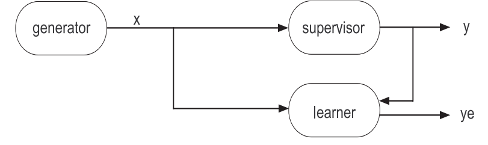
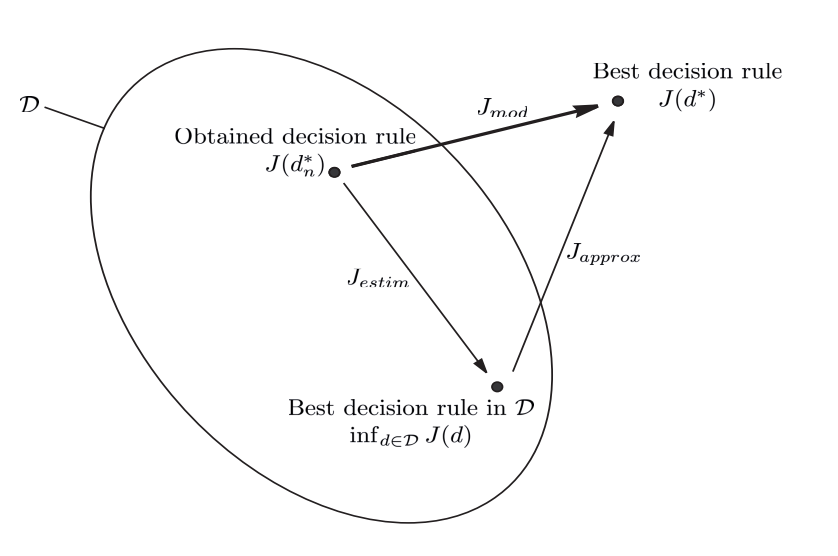
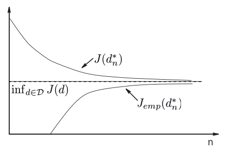
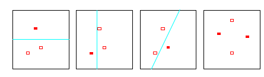
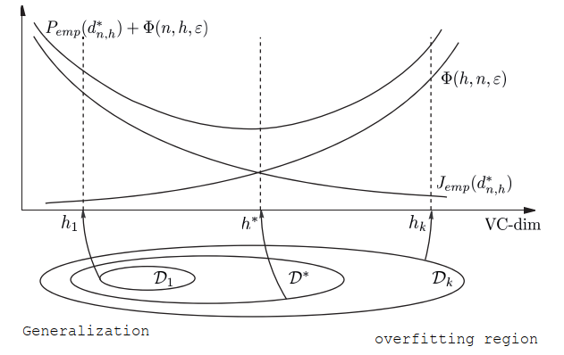
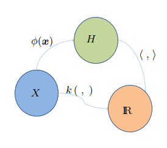
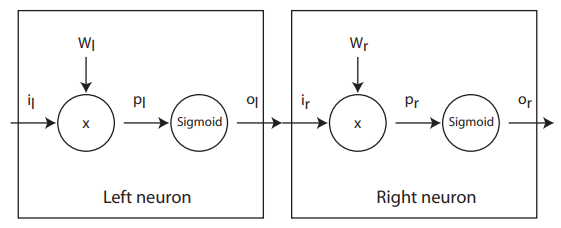

---
author:
- Juan Luis Barberia
date: January 2023
---

# Notes of OSS14 - Machine learning and artificial intelligence applications
This are some notes of the course that I took the summer of 2022/2023. It was a short course but full of information.
It was interesting to see how the algorithms works from a rigorous mathematical point of view.
Not like other courses that are a copy-paste from medium plus some sklearn examples.

## Resolution aproaches of problems

### Rule based

Normally, the term rule-based system is applied to systems involving
human-crafted or curated rule sets. Rule-based systems constructed using
automatic rule inference, such as rule-based machine learning, are
normally excluded from this system type.

        if X is grey and weight(X) > 1000 kg
            X is an elephant
        else
            X is not an elephant

Disadvantages:

-   Needs an expert

-   Need to translate expert thought to rules - complex, long, most of
    the time not reliable.

### Hypothesis testing approach

Hypothesis testing is a statistical method used to make inferences about
a population parameter based on a sample statistic. It involves
formulating a null hypothesis and an alternative hypothesis, and then
using sample data to decide which hypothesis is more likely to be true.
The decision is based on the calculated probability, known as the
p-value, of obtaining a sample statistic as extreme or more extreme than
the one observed, assuming the null hypothesis is true. If the p-value
is less than a pre-determined significance level (e.g. 0.05), the null
hypothesis is rejected and the alternative hypothesis is accepted.

$$
    \begin{cases}
        H_0: X \in \omega_0; & X ~ p(x | \omega_0)\\
        H_1: X \in \omega_1; & X ~ p(x | \omega_1)
    \end{cases}
$$

### Data driven approach

A data-driven approach is a method of problem-solving that relies on
analyzing data to inform decisions and actions. It involves collecting,
cleaning, and analyzing data to gain insights and make predictions.

## Bayes decision rule

$$P(c_j | x) = \frac{p(x | c_j) p(c_j)}{p(x)}$$

where:

-   $P(c_j | x)$ is the posterior probability.

-   $P(x | c_j)$ is the likelihood.

-   $p(c_j)$ is the prior that acts as a weight of the likelihood.

If we have two classes $\omega_1$ and $\omega_2$ we say that
$x \in \mathcal{X}$ belongs to:

-   $\omega_1$ if $p(\omega_1 | x) \ge p(\omega_2 | x)$

-   $\omega_2$ if $p(\omega_1 | x) \le p(\omega_2 | x)$

Then, trought the bayes theorem:

$$\frac{p(x|\omega_1)}{p(x|\omega_2)} \ge \frac{p(\omega_2)}{p(\omega_1)} \longrightarrow x \text{ belongs to }\omega_1$$

We can assume that the likelihood has a normal distribution $p(x | \omega_i) ~ N(\mu_i, \sigma_i)$ then we need to choose for a higher posterior probability. If the priors are equal trough classes, we can take the $log$ of the likelihood and compute a decision boundary for that.

$$p(\omega | x) = \frac{1}{\sqrt{(2\pi)^d \det{\Sigma^{-1}}}} \exp{\frac{(x-\mu)' \Sigma^{-1} (x-\mu)}{2}}$$

we dropped the $i$ indices for easiness, $g(x) = log(p(\omega | x))$

$$g(x) = \frac{-d \log{2\pi}}{2} + \frac{\log{\det{\Sigma^{-1}}}}{2} + \frac{(x-\mu)' \Sigma^{-1} (x-\mu)}{2}$$

expanding the last term:

$$g(x) = \frac{-d \log{2\pi}}{2} + \frac{\log{\det{\Sigma^{-1}}}}{2} + \frac{x'\Sigma^{-1}x}{2} - {\mu'\Sigma^{-1}x} + \frac{\mu'\Sigma^{-1}\mu}{2}$$

to make a comparison between some $g_i \forall i = 1 .. j$ we can drop
the first term, because is constant. Then the decision boundary is a
quadratic form (QDA). If we assume same
$\Sigma^{-1} \forall i = 1 .. j$ we can drop the quadratic term
and this give us a linear decision boundary (LDA).

### Maximum likelihood parameter estimation
There are cases where we know the family of the probability density
function of each class but the parameters are unknown. Via MLE (maximum
likelihood estimation) we can estimate the parameters using data coming
from these distributions. Finally with the obtained parameters we can
define a decision function via Bayes rule.

For a Gaussian distribution and a dataset $\mathcal{X} \in \mathcal{R}^n$ we take the $\log$-likelihood:

$$g(x) = \frac{-dn \log{2\pi}}{2} + \frac{n\log{\det{\Sigma^{-1}}}}{2} + \sum_{i=1}^{n}{\frac{(x_i-\mu)' \Sigma^{-1} (x_i-\mu)}{2}}$$

then applying the derivative respect $\mu$:

$$\frac{\partial g(x)}{\partial \mu} = \sum_{i=1}^{n}{\Sigma^{-1} (x - \mu)}$$

and finding the stationary point:

$$\frac{\partial g(x)}{\partial \mu} = 0 = \sum_{i=1}^{n}{\Sigma^{-1} (x - \mu)}$$

$$\hat{\mu} = \frac{1}{n} \sum_{i=1}^{n}{x}$$

thus the covariance is estimated as:

$$\hat{\Sigma} = \frac{1}{n} \sum_{i=1}^{n}{(x-\mu)'(x-\mu)}$$

### Non parametric density estimation
Sometimes we do not have a functional form to estimate the parameters
like the previous section. The **Parzen window** for density estimation
(kernel density estimation) is a non-parametric method to estimate the
probability density function of a random variable based on kernels as
weights.

$$\hat{f(x)} = \frac{1}{nh} \sum_{i=1}^{n}{K(\frac{x - x_i}{h})}$$

where $\hat{f}$ is the probability density function estimator (PDF). $h$ is
the width of the window. $K$ is a kernel that takes a point to estimate
($x$) and some samples $x_i$ for a given observation $\mathcal{X}$.

#### Kernels

-   Gaussian: $K(u) = \frac{1}{\sqrt{2\pi}} \exp(\frac{u^2}{2})$

-   Uniform:
    $K(u) = \frac{1}{2} \begin{cases} 1 & |u| \le 1 \\ 0 & \text{otherwise} \end{cases}$

#### Example

An example can be found in
<https://en.wikipedia.org/wiki/Kernel_density_estimation#Example>

#### Bandwidth selection
The bandwidth of the kernel is a free parameter which exhibits a strong
influence on the resulting estimate.

-   Bigger $h$ means more smooth

-   Smaller $h$ means more structure (more nervous response)

## K-Nearest Neighbor
K nearest neighbor (KNN) is a non-parametric and lazy learning
algorithm. It is a supervised learning algorithm used for classification
and regression.

In the classification setting, the algorithm works by finding the K
training examples that are closest to a given test example, and then
classifying the test example based on the majority class among its K
nearest neighbors. In the regression setting, the algorithm predicts the
value of a target variable by averaging the values of the K nearest
neighbors.

It acts like the bayes decision rule in some sense:

$$p(\omega_i | x) = \frac{p(x | \omega_1) p(\omega_1)}{p(x)} \equiv \frac{K_{\omega_i}}{K}$$

where $K_{\omega_i}$ is the count of neighbors that belongs to the class $\omega_i$

## Functional learning
The training model is composed for 3 elements: a generator of data
i.i.d. (independent and identically distributed), a supervisor to
generate the label, and a learner $d(x; \theta) \in \mathcal{D}$.

The main idea is to obtain the best combinations of parameters $\theta$
to predict as close as possible as the supervisor does.

### Empirical risk minimization
The optimal parameter selection is achieved with the following optimization problem:

$$\min_{\theta} J_{emp}(d) = \frac{1}{n} \sum_{i \in A_n}{Q(d(x_i; \theta), y_i)}$$

where $A_n$ is the training dataset and $Q$ is a cost function.

-   Quadratic cost: $Q(\hat{y}, y) = (\hat{y} - y)^2$

-   Absolute cost: $Q(\hat{y}, y) = ||\hat{y} - y||$

-   Cross-entropy:
    $Q(\hat{y}, y) = -y \log({\hat{y}}) - (1-y) \log({1 - \hat{y}})$

### Different errors in training

#### Approximation error

It is the difference in performance between the optimal decision rule $d^*$ and the best in $\mathcal{D}$:

$$J_{approx} = \inf_{d \in \mathcal{D}}{J(d)} - J(d^*)$$

Depends of the choice of the class $\mathcal{D}$.

#### Estimation error

It is the difference in performance between the best rule in
$\mathcal{D}$ and the one obtained at the end of learning process:

$$J_{estim} = J(d^*_n) - \inf_{d \in \mathcal{D}}{J(d)}$$

Depends of the data used to train the model class $\mathcal{D}$.

#### Modelling error
The objective of learning method is to minimize the modeling error,
defined by: $J_{mod} = J(d^*_n) - J(d^*)$ which is equivalent to:

$$J_{mod} = J_{estim} - J_{approx}$$

The problem with this is that we need to balance between:

-   increasing the number of tests in $\mathcal{D}$ leads to increase
    $J_{estim}$

-   increasing the number of tests in $\mathcal{D}$ leads to decrease
    $J_{approx}$

### Consistency of the induction principle
The minimization of empirical risk principle is consistent for the
chosen risk and a given problem if the learner does its best when the
sample size tends to infinity.

$$J(d^*_n) \xrightarrow[n \to \infty]{p} \inf_{d \in \mathcal{D}}{J(d)}$$

$$J_emp(d^*_n) \xrightarrow[n \to \infty]{p} \inf_{d \in \mathcal{D}}{J(d)}$$

## Vapnik-Chervonenkis dimension
The Vapnik-Chervonenkis dimension (VC dimension) is a measure of the
capacity of a statistical classification algorithm. Informally, the
capacity of a classification model is related to how complicated it can
be.

The first three panels show that the class of lines in the plane can
shatter three points. The last panel shows that this class cannot
shatter four points, as no line will put the hollow points on one side
and the solid points on the other. Hence the VC dimension of the class
of straight lines in the plane is three. Note that a class of nonlinear
curves could shatter four points, and hence has VC dimension greater
than three

The Vapnik-Chervonenkis dimension $h$ of a given class $\mathcal{D}$ of
detectors is defined as the largest number of samples $x_k$ from the
representation space $\mathcal{X}$ which can be split into any two
subset partition using detectors from $\mathcal{D}$.

In order, for the minimization of empirical risk principle, to be
consistent for any probability distribution it is sufficient for the
VC-dimension h of the detector class $\mathcal{D}$ to be finite.

## Structural risk minimization

Involves the construction of nested subsets:

$$\mathcal{D}_1 \subset ... \subset \mathcal{D}_k \subset \mathcal{D}$$

Then we find:

$$d^{*}_{n, k} = arg\min_{d \in \mathcal{D}_k}{P_{emp}(d)}$$

There is a probability larger or equal to $1 - \eta$ of:

$$P_e(d_n) \le P_{emp}(d_n) + \sqrt{\frac{h (\log{\frac{2n}{h}} + 1) - log{\frac{\eta}{4}}}{n}}$$

We can consider $\phi(h, n, \eta) = \sqrt{\frac{h (\log{\frac{2n}{h}} + 1) - log{\frac{\eta}{4}}}{n}}$
And from that list of minimum per subsets we choose the best guaranteed error:

$$d^*_{n} = arg\min_{k}{P_{emp}(d^*_{n, k}) + \phi(n, h_k, \eta))}$$

## Regularization

Regularization is important in data science because it helps to prevent
overfitting. Overfitting occurs when a model is too complex and is able
to fit the noise in the data, rather than just the underlying pattern.
Regularization adds a penalty term to the model's loss function, which
discourages large weights and helps to keep the model from becoming too
complex. This can improve the model's ability to generalize to new,
unseen data. Common types of regularization used in data science include
L1, L2, and dropout.

### Ivanov regularization

$$\begin{aligned}
    & \min \frac{1}{n}\sum_{k=1}^{n}{Q(\psi(x_k), y_k)}\\
    & \text{s.to.}\\
    & ||\psi||^2 \le A
\end{aligned}$$

Tikhonov regularization
-----------------------

The penalization acts as a smoothing parameter.

$$
\begin{aligned}
    \min \frac{1}{n}\sum_{k=1}^{n}{Q(\psi(x_k), y_k)} + \eta ||\psi||_{\mathcal{H}}^2
\end{aligned}
$$

Regularization tries to convert the Ill-posed problem of MRE to a
well-posed problem:

-   it has a solution

-   the solution is unique

-   the solution is a continuous function of the data (a small
    perturbation of the data produces a small perturbation of the
    solution)

## Reproducing Kernel Hilbert Space - RKHS

A RKHS is a Hilbert space of functions that have a specific reproducing
property. In other words, the inner product between any two functions in
the space can be computed by evaluating the functions at a single point
in the input space.

How can we find a function that minimizes the loss within an infinite dimensional space? All we need is simply equip $\mathcal{H}$ with an inner product that reproduces the kernel $K$ for every $u, v \in \mathcal{X}$, $\langle K_u, K_v \rangle = K(u, v)$.
With this specialized inner product, comes with the most powerful theorem.

A **representer theorem** is any of several related results stating that a minimizer $f^{*}$ of a regularized empirical risk functional defined over a reproducing kernel Hilbert space can be represented as a finit linear combination of kernel products evaluated on the input points in the training set data.

The conditions of a function to be a Kernel are fullfilled by the mercer theorem.

*Mercer theorem:* if $K$ is a continuous positive defined kernel based on an integral operator, which means that:

$$\int \int \phi(x) K(x, x') \phi^*(x') dx dx' \ge 0$$
for any $\phi \in \mathcal{L}_2(\mathcal{X})$ it can be decomposed as:

$$K(x, x') = \sum_{i=1}^{\infty}{\lambda_i \psi_i(x) \psi_(x')} = \langle \phi(x), \phi(x') \rangle$$

where $\psi_i$ and $\lambda_i$ are the eigenfunctions (orthogonales) and
eigenvalues (positives) of the kernel $K$, respectively, such that:

$$\int K(x, x') \psi_i(x) dx = \lambda_i \psi_i(x')$$

A kernel satisfying the mercer theorem can act as a scalar product in
$\mathcal{H}$, since $\phi$ can be decompose in a vector:

$$
\phi(x) = \begin{bmatrix}
        \sqrt{\lambda_1} \psi_1(x)\\
        \sqrt{\lambda_2} \psi_2(x)\\
        ...\\
    \end{bmatrix}
$$

the dot product of the functions is the dot product of the vector:
$$\langle \phi(x), \phi(x') \rangle = K(x, x')$$

### Example of kernels

| Radial Kernels |                                                           |
| -------------- | --------------------------------------------------------- |
| Gaussian       | $\exp(-\frac{1}{2\sigma_0^2}   \| x - x' \| ^2)$          |
| Exponential    | $\exp(-\frac{1}{2\sigma_0^2}   \| x - x' \| )$            |
| Uniform        | $\frac{1}{\eta_0^2} \mathbb{1} \| x - x' \| \le \beta_0)$ |

| Projective Kernels |                                 |
| ------------------ | ------------------------------- |
| Monomial           | $\langle x, x' \rangle^q$       |
| Polynomial         | $(1 + \langle x, x' \rangle)^q$ |

## Perceptron

The perceptron algorithm finds a solution with the minimum training error by the following update rule:

$$(\omega^*, b^*) = arg \min_{w, b}{\sum_{i=1}^{n}{|y_i - d(x_i; \omega, b)|}}$$

This is not the best way to split linear separable data. There is clever form to do it.

## Support vector machines

The main idea is to linear separate two groups of classes with an hyperplane. This hiperplane give the maximum margin separation among classes.

-   With a **weak margin** we get low generalization

-   With a **large margin** we get good generalization

### VC - dimension of SVM

If we consider the hiperplanes of the form:
$$\min_{x \in A_n}{|\langle \omega, x \rangle|} = 1$$

A function of type $d(x, \omega) = sign \langle \omega, x \rangle$ defined based on $A_n$ and satisfying the constraint $|\omega| \le \alpha$ has a VC-dimension $h$: 

$$h \le R^2\alpha^2$$

where $R$ is the radius of the smallest sphere centered in the origin that contains $A_n$. Then larger the margin $\rho = \frac{2}{|\omega|}$, leads to a lower $|\omega|$ and then $h$ is lower too.

### SVM Model

See derivation [here](svm_formulation.md).

### SVM Regression

The idea is to minimize the error outside of a given margin $\epsilon$.

$$\begin{aligned}
       & \min \frac{1}{2} |\omega|^2 + C \sum_{i=1}^{n}{\varepsilon_i + \varepsilon^*_i}\\
       & \text{s. to.}\\
       & y_i - (\langle \omega, x_i \rangle + b) \ge \epsilon + \varepsilon_i\\
       & (\langle \omega, x_i \rangle + b) - y_i \ge \epsilon + \varepsilon^*_i\\
       & \varepsilon_i \ge 0\\
       & \varepsilon^*_i \ge 0\\
    \end{aligned}$$

### $\nu$ - SVM

Is part of the one class classification model. This class of models aims
to detect data different from the training data.

-   Find the best hyperplane that separates data from origin.

-   Maximize the margin.

$$\begin{aligned}
        &\min \frac{1}{2} ||\omega||^2 + \rho + \frac{1}{n\nu}\sum_{i=1}^{n}{\varepsilon_i}\\
        &\text{s. to.}\\
        &y_i(\langle \omega, x_i \rangle + b) \ge 1 - \varepsilon_i \quad \forall i = 1..n\\
        &\varepsilon_i \ge 0 \quad \forall i =1..n\\
    \end{aligned}$$

### Link with parzen windows

If we set $\nu=1$, every point is a support vector. And if the kernel
function used is normalized, we get the same formula than the Parzen
windows probability density function.

$$\hat{f(x)} = \frac{1}{nh} \sum_{i=1}^{n}{K(\frac{x - x_i}{h})}$$

**Conclusion:** we are estimating the PDF of the training set $A_n$ with
the most relevant suport vectors ($\nu$ fraction).

### Suport vector data description - SVDD

Minimum enclosing hyper-sphere containing the data.

 $$\begin{aligned}
        &\min_{R, a, \varepsilon} \frac{1}{2} R^2 + C \sum_{i=1}^{n}{\varepsilon_i}\\
        & \text{s. to.}\\
        & ||x_i - a||^2 \le R^2 + \varepsilon_i \quad \forall i=1 .. n\\
        & \varepsilon_i \ge 0 \quad \forall i=1 .. n
\end{aligned}$$

-   one-class classification, positive examples only

-   can detect novel data

-   soft-margin with slack

-   related to density estimation (level sets)

### Secuential minimization optimization (SMO)

For the SVM optimization problem: 

$$\begin{aligned}
    &\min_{\omega, b} \frac{1}{2}||\omega||^2 + C \sum_{i=1}^{n}{\varepsilon_i}\\
    &\text{s. to.}\\
    &y_i(\langle \omega, x_i \rangle + b) \ge 1 - \varepsilon_i \quad \forall i=1..n\\
    &\varepsilon_i \ge 0 \quad \forall i=1..n
\end{aligned}$$

It is more easy to solve it's dual:

$$\begin{aligned}
    &\max_{\alpha} W(\alpha) = \sum_{i=1}^{n}{\alpha_i} - \frac{1}{2}\sum{i=1}^{n}\sum_{j=1}^{n}{y_i y_j \alpha_i \alpha_j \langle x_i, x_j \rangle}\\
    &\text{s. to.}\\
    &0 \le \alpha_i \le C \quad \forall i=1..n\\
    &\sum_{i=1}^{n}{\alpha_i y_i} = 0 \quad \forall i=1..n\\
\end{aligned}$$

There are two components to SMO: an analytic method
for solving for the two Lagrange multipliers, and a heuristic for
choosing which multipliers to optimize. The SMO algorithm is as follows:

1.  Heuristically choose a pair of $\alpha_i$ and $\alpha_j$

2.  Keeping all other $\alpha$'s fixed, optimize $W(\alpha)$ with
    respect to $\alpha_i$ and $\alpha_j$

The convergence of SMO is checked by the KKT complementary condition.
That is why we need to choose at least 2 $\alpha$'s to update it is
value per iteration.

There are two separate choice heuristics: one for the first Lagrange
multiplier and one for the second. The choice of the first heuristic
provides the outer loop of the SMO algorithm. The outer loop first
iterates over the entire training set, determining whether each example
violates the KKT conditions. If an example violates the KKT conditions,
it is then eligible for optimization. After one pass through the entire
training set, the outer loop iterates over all examples whose Lagrange
multipliers are neither 0 nor C (the non-bound examples). Again, each
example is checked against the KKT conditions and violating examples are
eligible for optimization. The outer loop makes repeated passes over the
non-bound examples until all of the non-bound examples obey the KKT
conditions within $\epsilon$. The outer loop then goes back and iterates
over the entire training set. The outer loop keeps alternating between
single passes over the entire training set and multiple passes over the
non-bound subset until the entire training set obeys the KKT conditions
within $\epsilon$, whereupon the algorithm terminates.

## PCA

We search $u$ such that $||u|| = 1$ and the projection of $X$ on the
axis carried by $u$ captures the most variance.

$$\begin{aligned}
    & \max_{u} u' X' X u\\
    & \text(s. to.)\\
    & u' u = 1
\end{aligned}$$

With the dual problem as:

$$\begin{aligned}
    & \max_{\lambda}{\min_{u}{ - u'X'X u + \lambda(u'u -1)}}
\end{aligned}$$

see (here)[https://stats.stackexchange.com/questions/10251/what-is-the-objective-function-of-pca] for more info.

## Artificial Neural Networks

### Transfer functions

| Typical activation functions |                        |
| ---------------------------- | ---------------------- |
| ReLU                         | $\phi(x) = \max{0, x}$ |
| Sigmoid                      | $\frac{1}{1+e^{-x}}$   |
| SoftPlus                     | $\log{1+e^x}$          |

### Universal approximation theorem
A feed forward network with a single hidden layer and a finite number of neurons can approximate continuous functions $f$ on compact subsets $I_m$ of $\mathcal{R}^n$. The assumptions of the activation function are mild: non-constant, bounded, monotonically increasing, continuous. let $\phi(x)$ an activation function with the given characteristics. There exists $N$, $v_i$, $b_i$, $w_i$ $\in \mathcal{R}^m$ such that:

$$F(x) = \sum_{i=1}^{n}{v_i \phi(w_i' x + b_i)}$$

$$||F(x) - f(x)|| \le \epsilon \quad \forall x \in I_m$$

### Chain Rule

#### Gradient descent
Suppose that we have some performance $P$ as a function of $o_r$. The derivative with respect $w_r$ is:

$$\frac{\partial P}{\partial w_r} = \frac{\partial P}{\partial o_r} \times \frac{\partial o_r}{\partial w_r}$$

To get to the left neuron we need to extend the chain rule:

$$\frac{\partial P}{\partial w_r} = 
    \frac{\partial P}{\partial o_r} \times
    \frac{\partial o_r}{\partial p_r} \times
    \frac{\partial p_r}{\partial o_l} \times
    \frac{\partial o_l}{\partial p_l} \times
    \frac{\partial p_l}{\partial w_l}$$

#### Batch gradient descent

Batch gradient descent sums the error for each point in a training set,
updating the model only after all training examples have been evaluated.
This process referred to as a training epoch.

While this batching provides computation efficiency, it can still have a
long processing time for large training datasets as it still needs to
store all of the data into memory. Batch gradient descent also usually
produces a stable error gradient and convergence, but sometimes that
convergence point isn't the most ideal, finding the local minimum versus
the global one.

### Stochastic gradient descent

Stochastic gradient descent (SGD) runs a training epoch for each example
within the dataset and it updates each training example's parameters one
at a time. Since you only need to hold one training example, they are
easier to store in memory. While these frequent updates can offer more
detail and speed, it can result in losses in computational efficiency
when compared to batch gradient descent. Its frequent updates can result
in noisy gradients, but this can also be helpful in escaping the local
minimum and finding the global one.

### Mini-batch gradient descent

Mini-batch gradient descent combines concepts from both batch gradient
descent and stochastic gradient descent. It splits the training dataset
into small batch sizes and performs updates on each of those batches.
This approach strikes a balance between the computational efficiency of
batch gradient descent and the speed of stochastic gradient descent.

## Lagragian Duality

Given the following problem

$$\begin{aligned}
    & \min_{x}{f(x)}\\
    & \text{s.to.}\\
    & g_i(x) \le 0 \forall i = 1..n
\end{aligned}$$

The dual problem is:

$$\max_{\lambda}{w(\lambda)} = \max_{\lambda} \min_{x} L(x, \lambda)\\
    \lambda \in \mathcal{R}^{m+}$$

## Karush-Kuhn-Tucker conditions

Given the problem:

$$\begin{aligned}
    & \min_{x}{f(x)}\\
    & \text{s.to.}\\
    & g_i(x) \le 0 \forall i = 1..n
\end{aligned}$$

The KKT conditions are:

**Stationarity:**
 
$$\nabla{f(x^*)} + \sum_{i=1}^{n}{\lambda_i \nabla g_i(x^*)} = 0$$

**Primal feasibility:**

$$g_i(x) \le 0 \forall i = 1..n$$

**Dual feasibility:**

$$\lambda_i \ge 0 \forall i = 1..n$$

**Complementary slackness:**

$$\lambda_i g_i(x^*) = 0$$

## Bias vs Variance

In machine learning, bias refers to the error introduced by
approximating a real-world problem, which may be very complex, by a
simpler model. High bias can cause an algorithm to miss important
relationships in the data. Variance, on the other hand, refers to the
error introduced by the variability of a model's predictions for a given
set of training data. High variance can cause an algorithm to fit the
noise in the data, rather than the underlying pattern. The trade-off
between bias and variance is known as the bias-variance trade-off.

## Curse of dimensionality

The curse of dimensionality refers to the challenges and difficulties
that arise when working with high-dimensional data. This can include:

-   The exponential increase in the volume of the data space as the
    number of dimensions increases, which makes it harder to find
    patterns and relationships in the data.

-   The need for a exponentially larger amount of data to estimate the
    underlying distribution of the data as the number of dimensions
    increases.

-   The decrease in performance of many machine learning algorithms as
    the number of dimensions increases, due to the algorithms'
    difficulty in handling the increased complexity of the data.

-   The difficulty of visualizing high-dimensional data, as it is hard
    to plot more than a few dimensions at once.

-   The existence of the concentration of measure phenomenon, meaning
    that the mass of the data is concentrated near a lower dimensional
    structure, and a small proportion of it is spread out in the high
    dimensional space, making it hard to find.

-   Therefore, techniques such as dimensionality reduction, feature
    selection, and manifold learning are often used to mitigate the
    curse of dimensionality.
